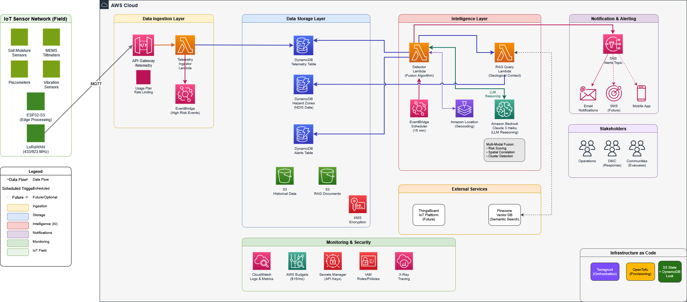

# OpenLEWS - Open Landslide Early Warning System

<div align="center">

**A Neuro-Symbolic IoT-LLM Framework for Landslide Prediction in Sri Lanka's Central Highlands**

[](https://opensource.org/licenses/MIT)
[](https://aws.amazon.com/)
[](https://www.python.org/)
[](https://terragrunt.gruntwork.io/)
[](https://claude.ai)
[]()


</div>

---

## Overview

OpenLEWS is a research prototype for an AI-powered landslide early warning system designed for Sri Lanka's Central Highlands. The system integrates IoT sensor networks with neuro-symbolic AI architecture to provide site-specific, deterministic slope stability monitoring—moving beyond traditional regional rainfall threshold approaches.

### The Problem

Sri Lanka's central highlands face increasing landslide hazards driven by:
- Deep lateritic weathering profiles susceptible to rainfall-induced failures
- Intense monsoonal precipitation (Southwest and Northeast monsoons)
- Anthropogenic land-use changes in marginally stable slopes

Current NBRO (National Building Research Organisation) early warning systems rely on regional rainfall thresholds (75/100/150mm for Yellow/Orange/Red) that:
- Cannot account for localized geotechnical conditions
- Result in false positives ("cry wolf" syndrome) or missed events
- Use rainfall as a proxy rather than measuring actual slope stability parameters

### The Solution

OpenLEWS implements a paradigm shift from regional probabilistic forecasting to site-specific deterministic monitoring through:

1. **Multi-Sensor Fusion**: IoT sensors measuring soil moisture, tilt, vibration, pore pressure, and safety factor
2. **Neuro-Symbolic AI**: Combines weighted risk scoring with rule-based geological reasoning
3. **RAG-Enhanced Context**: Retrieval-Augmented Generation using NDIS geological hazard zone data
4. **LLM Alert Generation**: Context-aware warnings via Amazon Bedrock (Claude 3 Haiku)

---

## Architecture

### Architecture diagram (HTML)

Interactive view: https://akilada.github.io/openlews-prototype-v2/openlews-architecture-v2.html

### Logical Architecture (Layered View)

```
┌─────────────────────────────────────────────────────────────────────────────┐
│                         PRESENTATION LAYER                                  │
│   ┌──────────────────┐   ┌──────────────────┐   ┌────────────────────────┐  │
│   │ ThingsBoard      │   │ React Dashboard  │   │ SNS Notifications      │  │
│   │ IoT Platform     │   │ (Future)         │   │ (Email/SMS)            │  │
│   └──────────────────┘   └──────────────────┘   └────────────────────────┘  │
└─────────────────────────────────────────────────────────────────────────────┘
                                   ↕ REST API (API Gateway)
┌─────────────────────────────────────────────────────────────────────────────┐
│                       APPLICATION LAYER (AWS Lambda)                        │
│                                                                             │
│   ┌──────────────────────────────────────────────────────────────────────┐  │
│   │                    Telemetry Ingestor Lambda                         │  │
│   │  - TelemetryValidator (required fields, range validation)            │  │
│   │  - NDISEnricher (geohash4 lookup, bounding box containment)          │  │
│   │  - TelemetryWriter (DynamoDB batch write, 30-day TTL)                │  │
│   │  - EventBridgePublisher (high-risk event publishing)                 │  │
│   └──────────────────────────────────────────────────────────────────────┘  │
│                                   ↓                                         │
│   ┌──────────────────────────────────────────────────────────────────────┐  │
│   │                    Detection Engine Lambda                           │  │
│   │  - RiskScorer (moisture, tilt, vibration, pore pressure, safety)     │  │
│   │  - FusionAlgorithm (spatial correlation, cluster detection)          │  │
│   │  - BedrockClient (Claude risk assessment + narrative generation)     │  │
│   │  - AlertManager (create, deduplicate, escalate alerts)               │  │
│   └──────────────────────────────────────────────────────────────────────┘  │
│                                   ↓                                         │
│   ┌──────────────────────────────────────────────────────────────────────┐  │
│   │                    RAG Query Lambda                                  │  │
│   │  - Geohash-based hazard zone lookup (precision 4)                    │  │
│   │  - Nearest zone queries with Haversine distance                      │  │
│   │  - Radius-based multi-zone queries                                   │  │
│   └──────────────────────────────────────────────────────────────────────┘  │
└─────────────────────────────────────────────────────────────────────────────┘
                                   ↕
┌─────────────────────────────────────────────────────────────────────────────┐
│                            DATA LAYER                                       │
│   ┌──────────────────┐   ┌──────────────────┐   ┌────────────────────────┐  │
│   │ DynamoDB         │   │ DynamoDB         │   │ DynamoDB               │  │
│   │ Telemetry Table  │   │ Hazard Zones     │   │ Alerts Table           │  │
│   │ PK: sensor_id    │   │ PK: zone_id      │   │ PK: alert_id           │  │
│   │ SK: timestamp    │   │ GSI: GeoHashIndex│   │ SK: created_at         │  │
│   └──────────────────┘   └──────────────────┘   └────────────────────────┘  │
│                                                                             │
│   ┌──────────────────┐   ┌──────────────────┐   ┌────────────────────────┐  │
│   │ Pinecone         │   │ S3 Artifacts     │   │ Secrets Manager        │  │
│   │ Vector DB        │   │ Lambda packages  │   │ Pinecone API key       │  │
│   │ (384-dim)        │   │                  │   │                        │  │
│   └──────────────────┘   └──────────────────┘   └────────────────────────┘  │
└─────────────────────────────────────────────────────────────────────────────┘
                                   ↕
┌─────────────────────────────────────────────────────────────────────────────┐
│                         INTELLIGENCE LAYER                                  │
│   ┌──────────────────┐   ┌──────────────────┐   ┌────────────────────────┐  │
│   │ Amazon Bedrock   │   │ Amazon Location  │   │ Multi-Modal Fusion     │  │
│   │ Claude 3 Haiku   │   │ Service          │   │ Algorithm              │  │
│   │ - Risk assess    │   │ - Reverse geocode│   │ - Spatial correlation  │  │
│   │ - Narratives     │   │ - Address lookup │   │ - Cluster detection    │  │
│   └──────────────────┘   └──────────────────┘   └────────────────────────┘  │
└─────────────────────────────────────────────────────────────────────────────┘
```

### AWS Cloud Architecture



---

## Project Structure

```
openlews-prototype-v2/
├── infrastructure/                     # Terragrunt/OpenTofu IaC
│   ├── terragrunt.hcl                  # Root configuration
│   ├── environments/
│   │   ├── dev/
│   │   │   ├── env.hcl                 # Dev environment variables
│   │   │   └── terragrunt.hcl          # Dev Terragrunt config
│   │   ├── uat/                        # UAT (placeholder)
│   │   └── prod/                       # Production (placeholder)
│   └── modules/
│       ├── all/                        # Orchestrator module
│       │   ├── main.tf
│       │   └── variables.tf
│       ├── budgets/                    # AWS Budgets
│       ├── dynamodb/                   # DynamoDB tables
│       ├── s3/                         # S3 buckets
│       ├── secrets/                    # Secrets Manager
│       ├── location/                   # Amazon Location Service
│       └── lambda/
│           ├── detector/               # Detection engine
│           │   ├── main.tf
│           │   ├── bedrock.tf
│           │   ├── variables.tf
│           │   ├── outputs.tf
│           │   └── build.sh
│           ├── rag_query/              # RAG query engine
│           │   ├── main.tf
│           │   └── build.sh
│           └── telemetry_ingestor/     # Telemetry ingestion
│               ├── main.tf
│               ├── api_gateway.tf
│               └── build.sh
├── src/
│   ├── lambdas/
│   │   ├── telemetry_ingestor/
│   │   │   ├── ingestor_lambda.py      # Main handler
│   │   │   └── requirements.txt
│   │   ├── detector/
│   │   │   ├── detector_lambda.py      # Main handler
│   │   │   ├── core/
│   │   │   │   ├── fusion_algorithm.py # Spatial correlation
│   │   │   │   └── risk_scorer.py      # Risk calculation
│   │   │   ├── clients/
│   │   │   │   ├── alert_manager.py    # Alert lifecycle
│   │   │   │   ├── bedrock_client.py   # LLM integration
│   │   │   │   └── rag_client.py       # RAG Lambda client
│   │   │   ├── utils/
│   │   │   │   ├── telemetry_fetcher.py
│   │   │   │   └── location_resolver.py
│   │   │   └── requirements.txt
│   │   └── rag/
│   │       ├── rag_query_lambda.py     # Geospatial queries
│   │       └── requirements.txt
│   └── data_ingestion/
│       └── NSDI/
│           ├── rag_pipeline/
│           │   ├── ndis_rag_pipeline.py    # Main pipeline
│           │   ├── geo_processor.py        # Shared processor
│           │   └── process_backup.py       # Backup processor
│           └── scripts/
│               ├── setup_pinecone_index.py
│               └── analyse_data.py
├── docs/                               # Documentation
└── tests/                              # Test suites
```

---

## Key Components

### 1. Telemetry Ingestor Lambda

Receives and processes sensor telemetry:

| Component | Function |
|-----------|----------|
| `TelemetryValidator` | Validates required fields, ranges, timestamps |
| `NDISEnricher` | Enriches with hazard zone data via geohash4 lookup |
| `TelemetryWriter` | Batch writes to DynamoDB with 30-day TTL |
| `EventBridgePublisher` | Publishes high-risk events (moisture ≥85%, etc.) |

**High-Risk Thresholds:**
- moisture_percent ≥ 85%
- pore_pressure_kpa ≥ 10 kPa
- tilt_rate_mm_hr ≥ 5 mm/hr
- safety_factor < 1.2
- High/Very High hazard zone AND moisture > 70%

### 2. Detection Engine Lambda

Scheduled analysis with LLM reasoning:

| Component | Function |
|-----------|----------|
| `RiskScorer` | Weighted scoring (moisture 35%, tilt 25%, vibration 15%, pore 15%, safety 10%) |
| `FusionAlgorithm` | Spatial correlation, composite risk, cluster detection (3+ sensors) |
| `BedrockClient` | Claude risk assessment and narrative generation |
| `AlertManager` | Alert creation, deduplication, escalation (Yellow→Orange→Red) |
| `LocationResolver` | Amazon Location Service reverse geocoding |

**Risk Scoring Weights:**
```python
WEIGHTS = {
    'moisture': 0.35,
    'tilt_velocity': 0.25,
    'vibration': 0.15,
    'pore_pressure': 0.15,
    'safety_factor': 0.10
}
```

**Historical Event Calibration:**
- Aranayake 2016: 5mm/hr tilt rate observed 6 hours before failure
- Meeriyabedda 2014: 5x baseline vibration (acoustic emissions)

### 3. RAG Query Lambda

Geological context retrieval:

| Query Type | Function |
|------------|----------|
| `nearest` | Find single nearest hazard zone |
| `radius` | Find all zones within radius |
| `semantic` | Vector search (placeholder) |

**Geohash Configuration:**
- Precision 4: ~39km × 19km cells
- 9-cell expansion (center + 8 neighbors)
- Haversine distance filtering

### 4. NDIS Data Ingestion Pipeline

Processes NDIS ArcGIS REST API data:

| Component | Function |
|-----------|----------|
| `NSDIDownloader` | Paginated API downloads (1000 records/batch) |
| `GeoJSONProcessor` | Centroid extraction, geohash, normalization |
| `EmbeddingGenerator` | sentence-transformers (all-MiniLM-L6-v2, 384-dim) |
| `DynamoDBIngester` | Batch writes (25 items) with size validation |
| `PineconeIngester` | Vector upserts (100 per batch) |

**Data Statistics:**
- 19,000+ NDIS hazard zones for Badulla region
- Hazard distribution: High 42.8%, Moderate 35.8%, Low 12.8%, Very High 8.6%

---

## Alert Levels

| Level | Composite Risk | Trigger Conditions | Action |
|-------|---------------|-------------------|--------|
| **Green** | < 0.4 | Normal operations | Log data (15 min interval) |
| **Yellow** | 0.4 - 0.6 | Single indicators elevated | Monitor closely |
| **Orange** | 0.6 - 0.8 | Multiple indicators, spatial correlation | Prepare evacuation |
| **Red** | > 0.8 | Critical thresholds, cluster detected | Evacuate immediately |

### Escalation Logic

```python
def should_escalate(existing_alert, new_assessment):
    # Escalate if risk level increased
    if risk_hierarchy[new_level] > risk_hierarchy[current_level]:
        return True
    
    # Escalate if confidence significantly increased (+0.15)
    if new_assessment['confidence'] > existing_alert['confidence'] + 0.15:
        return True
    
    return False
```

---

## Infrastructure Configuration

### Development Environment (`env.hcl`)

```hcl
# AWS
aws_region = "ap-southeast-2"
environment = "dev"
project_name = "openlews"

# Cost Control
monthly_budget_usd = 15

# Lambda
lambda_memory_mb = 256
lambda_timeout_seconds = 60
lambda_log_level = "INFO"

# DynamoDB
dynamodb_ttl_days = 10
enable_point_in_time_recovery = false

# Detector
risk_threshold = 0.6
bedrock_model_id = "anthropic.claude-3-haiku-20240307-v1:0"
schedule_expression = "rate(15 minutes)"

# API Gateway
enable_api_key_auth = true
api_quota_limit = 100000
api_burst_limit = 100
api_rate_limit = 50

# RAG
geohash_precision = 4
pinecone_index_name = "lews-geological-knowledge"
```

---

## Getting Started

### Prerequisites

- AWS Account with appropriate permissions
- Python 3.11+
- Terragrunt and OpenTofu installed
- Pinecone account (free tier)

### Infrastructure Deployment

```bash
# Clone the repository
git clone https://github.com/akilada/openlews-prototype-v2.git

cd openlews-prototype-v2

# Initial Setup
cd scripts/setup
./initial_setup.sh


# Configure AWS credentials
export AWS_PROFILE=openlews-dev

# Deploy infrastructure
cd infrastructure/environments/dev
terragrunt init
terragrunt plan
terragrunt apply
```

### NDIS Data Ingestion

```bash
cd src/data_ingestion/NSDI

# Set environment variables
export AWS_REGION=ap-southeast-2
export DYNAMODB_TABLE_NAME=openlews-dev-hazard-zones
export PINECONE_API_KEY=pinecone-api-key
export PINECONE_INDEX_NAME=pinecone-index-name

# Run pipeline
python rag_pipeline/ndis_rag_pipeline.py

# Or with bounds filter for Badulla region
python rag_pipeline/ndis_rag_pipeline.py --filter-bounds 6.8,7.2,80.8,81.2
```

### Testing Telemetry Ingestion

```bash
# Get API endpoint from Terraform output
API_ENDPOINT=$(terragrunt output -raw api_endpoint)

# Send test telemetry
curl -X POST "$API_ENDPOINT/telemetry" \
  -H "Content-Type: application/json" \
  -H "x-api-key: YOUR_API_KEY" \
  -d '{
    "telemetry": [{
      "sensor_id": "SENSOR_001",
      "timestamp": 1735430400,
      "latitude": 6.85,
      "longitude": 80.93,
      "geohash": "tc1xyz",
      "moisture_percent": 75.5,
      "tilt_x_degrees": 0.5,
      "tilt_y_degrees": 0.3,
      "pore_pressure_kpa": 5.2,
      "vibration_count": 12,
      "safety_factor": 1.8
    }]
  }'
```

---

## Cost Estimation

Monthly operational costs (USD) for development prototype:

| Service | Usage | Cost |
|---------|-------|------|
| Lambda | ~1M requests | $0.20 |
| DynamoDB | PAY_PER_REQUEST, 10-day TTL | $5.00 |
| S3 | Lambda artifacts | $0.50 |
| Pinecone | Free tier (100K vectors) | $0.00 |
| AWS Bedrock (Claude Haiku) | ~200K tokens | $2-4.00 |
| API Gateway | 100K requests | $0.35 |
| CloudWatch Logs | 3-day retention | $0.50 |
| Amazon Location | Reverse geocoding | $0.50 |
| **Total** | | **~$10-15/month** |

Budget alert configured at $15/month.

---

## Success Metrics

### Technical Metrics
- Detection accuracy: >85% for simulated Aranayake scenario
- False positive rate: <15%
- Alert latency: <5 minutes from threshold breach
- Spatial correlation: >70% agreement among neighboring sensors

### Demonstration Metrics
- Scenario coverage: Aranayake 2016, Meeriyabedda 2014, False Alarm
- RAG accuracy: >90% correct geological context retrieval
- Narrative quality: Human evaluators rate alerts as "clear and actionable"

---

## Component Documentation

| Component | README |
|-----------|--------|
| Detection Engine | [src/lambdas/detector/README.md](src/lambdas/detector/README.md) |
| Telemetry Ingestor | [src/lambdas/telemetry_ingestor/README.md](src/lambdas/telemetry_ingestor/README.md) |
| RAG Query Engine | [src/lambdas/rag/README.md](src/lambdas/rag/README.md) |
| NDIS Data Ingestion | [src/data_ingestion/NSDI/README.md](src/data_ingestion/NSDI/README.md) |
| Infrastructure | [infrastructure/README.md](infrastructure/README.md) |

---

## Contributing

This is a research prototype. Contributions are welcome for:
- Additional failure scenario simulations
- Improved detection algorithms
- Multilingual alert generation (Sinhala/Tamil)
- Dashboard enhancements

Please open an issue to discuss proposed changes before submitting a pull request.

---

## License

This project is licensed under the MIT License - see the [LICENSE](LICENSE) file for details.

---

## Acknowledgments

- **NBRO Sri Lanka**: Landslide hazard zonation data and research collaboration
- **NDIS Sri Lanka**: Geospatial hazard zone data via ArcGIS REST API
- **Anthropic**: Claude models for neuro-symbolic reasoning
- **AWS**: Cloud infrastructure, Bedrock, and Location Service
- **Google Gemini**: Deep Research on Landslides and Fact checking

---

## References

1. NBRO. "Landslide Hazard Zonation Mapping Programme." National Building Research Organisation, Sri Lanka.
2. Dissanayake et al. "Rain Induced Landslides in Sri Lanka." ResearchGate, 2016.
3. JICA. "Aranayake Landslide Technical Report." Japan International Cooperation Agency, 2016.
4. Fredlund, D.G. "The scope of unsaturated soil mechanics." Canadian Geotechnical Journal, 1997.

---

<div align="center">

**Built with ❤️ for disaster resilience in Sri Lanka**

</div>